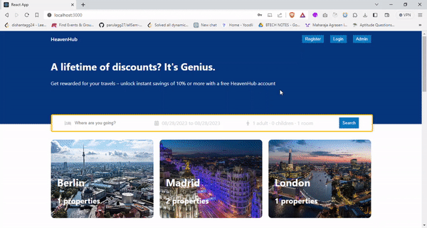

<h1 align="center"> HeavenHub (Hotel Booking Web App)</h1>

## About The Project :eyes: 

* A **Full Stack Hotel Booking** web application.
* User authentication and registration.
* Browse available hotels with details and images.
* Search for hotels based on location, dates, and preferences.
* Hotel reservation functionality.
* User dashboard to manage bookings.
* Admin dashboard to manage hotels and bookings.
* Interactive UI for a seamless user experience.

### Overview


### User authentication and registration.



### Admin authentication and dashboard.


## Getting Started 🚀 

To get a local copy up and running follow these simple example steps.

### Prerequisites 💻 

- Node ([Download here!](https://nodejs.org/en/download))

### Installation :arrow_down: 

**1.** Fork [this](https://github.com/dishantagg24/hotel-reservation-frontend) repository :fork_and_knife:

**2.** Clone your forked repository to your local system :busts_in_silhouette:

```sh
git clone https://github.com/<your-username>/hotel-reservation-frontend.git
```

Or Download and extract the zip file.

### Running

**1.** Install NPM packages :arrow_down:

```sh
npm install
```

**2.** Run! :running_man:

```sh
npm start
```

<!-- CONTRIBUTING -->

## Contributing 🤝 

Any contributions you make are **greatly appreciated**.

1. Create your Branch (`git checkout -b master/test-branch`)
2. Commit your Changes (`git commit -m 'Add some code'`)
3. Push to the Branch (`git push origin master/test-branch`)
4. Open a Pull Request

<!-- CONTACT -->

## Authors :closed_book: 

- [Dishant Aggarwal](https://github.com/dishantagg24)
